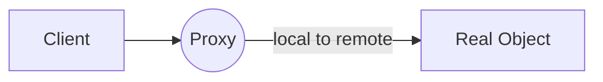
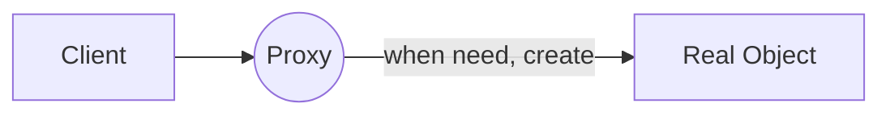

proxy란 접근을 제어하고 관리하는 것이며 진짜 Object를 대신하는 role을 맡는다.

## 1. Proxy Pattern Definition
- 실제 기능을 수행하는 Real Object대신 가상의 Proxy Object를 사용해 logic flow을 control하는 design pattern이다.
## 2. Proxy Pattern의 특징
- 부가적인 작업(logging, authentication, network 통신 등) 수행에 쓰임
## 3. Proxy Pattern의 Simple Class
- Real Object, Proxy Object는 동일한 인터페이스를 구현
- Proxy Object는 method 수행 시 Real Object의 method에 위임

## 4. Proxy의 종류
proxy pattern의 다양한 변종이 많으나, 그 공통점은 client에서 real object의 method를 호출 시, 그 호출을 중간에 가로챈다는 것이다.
### 4.1. Remote Proxy
- remote object: 다른 JVM의 heap에서 살고 있는 객체



proxy는 remote object인 것 같지만, object의 탈을 쓰고 있을 뿐임.
network 통신과 관련 된 저수준 작업은 이 proxy object에서 처리해 줌. -> ex) RMI (remote method invocation)
### 4.2. Virtual Proxy
"생성하는 데 비용이 많이 드는" 커다란 객체에 대해 생성 시점을 제어할 수 있다. 



### 4.3. Protection Proxy


Protection proxy 란 access right(접근 권한)을 바탕으로 객체에 대한 접근을 제어하는 proxy 이다.

#### 4.3.1. Step 1: InvocationHandler 만들기
  java 에는 proxy이 기능이 내장 되어 있으며 java.lang.reflect package 에 들어 있다.
 이를 통해 만들어지는 proxy class는 실행 중에 생성 되므로, dynamic proxy라고 부른다.
 이 Proxy는 java가 만들어 주기 때문에 Proxy class한테 무슨 일을 할 지 알려주기 위한 방법으로 InvocationHandler를 집어 넣게 된다. InvocationHandler는 proxy에 대해서 호출되는 모든 method에 대해 응답하는 역할을 맡는다.

```java
import java.lang.reflect.*; // InvocationHandler가 이 package에 들어 있음.

public class OwnerInvocationHandler implements InvocationHandler {
	PersonBean person;
	
	public OwnerInvocationHandler(PersonBean person) {
		this.person = person;
	}
	
	public Object invoke(Object proxy, Method method, Object[] args) throws  IllegalAccessException {
		try {
			if (method.getName().startWith("get") {
				return method.invoke(person, args);
			} else if (method.getName().equals("setHotOrNotRating")) {
				throw new IllegalAccessException();	
			} else if (method.getName().startWith("set")) {
				return method.invoke(person, args);
			}
		} catch(InvocationTargetException e) { // realObject에서 exception을 던졌을 때
			e.printStackTrace();
		}
		return null;
	}
}
```
#### 4.3.2. Step 2: Proxy Object Instance 만들기
```java
PersonBean getOwnerProxy(PersonBean person) {
	return (PersonBean) Proxy.newProxyInstance( // proxy 생성
			person.getClass().getClassLoader(),
			person.getClass().getInterfaces(),
			new OwnerInvocationHandler(person));
}
```
> **ClassLoader?**
> abstract class로써 byte code를 읽여들여서 class 객체를 생성하는 역할 

## 4. Proxy 관련 Q&A
Q: Proxy class인지 알 수 있는 방법은?
A: Proxy class에는 isProxyClass()라는 static method가 있다. 이 점을 제외하면 지정해 준 interface를 구현하는 다른 class하고 똑같은 방식으로 동작한다.
Q: newProxyInstance()를 호출할 때 인자로 전달할 수 있는 interface 형식에 제한이 있는가?
A: 몇 가지 제한이 있는데 우선 항상 interface의 배열을 인자로 전달해야 한다는 점

## 5. Proxy의 실전 적용
- 방화벽 proxy: network 자원에 대한 접근을 제어함으로써 주 객체를 "나쁜" 클라이언트로 부터 보호
> 기업용 방화벽 system 에서 자주 사용
- Smart Reference Proxy : 주 객체가 참조될 때마다 추가 행동을 제공한다. object에 대한 reference 개수를 센다든가 하는 식.
> C++과 같은 낮은 수준 언어에 대해 원시 포인터에 대한 안전한 관리를 위해 smart pointer를 두고, 실제 address에 대해 이 smart pointer를 통해 참조토록 함.
- Caching Proxy: 비용이 많이 드는 작업의 결과를 임시로 저장. 여러 클라이언트에서 결과를 공유하게 해 줌으로써 계산 시간 또는 네트워크 지연을 줄여주는 효과가 있음.
> Web Server Proxy 등에서 볼 수 있음.
- Synchronization Proxy: 여러 thread에서 주 객체에 접근하는 경우에 안전하게 작업을 처리할 수 있게 해줌
- Complexity Hiding Proxy: 복잡한 class들의 집합에 대한 접근을 제어하고, 그 복잡도를 숨겨준다. Facade Proxy (퍼사드 프록시) 라고 부르기도 한다. 이 프록시와 퍼사드 패턴의 차이점은 프록시에서는 접근을 제어하지만 퍼사드 패턴에서는 대체 interface만 제공한다.
- Copy-On-Write Proxy(지연 복사 프록시): client에서 필요로 할 때까지 객체가 복사되는 것을 지연.

## Core  theorem
- Decorator pattern에서는 Object에 대한 행동을 추가하지만 Proxy Pattern은 access를 control 한다.

> 출처 : Head first Design Pattern
